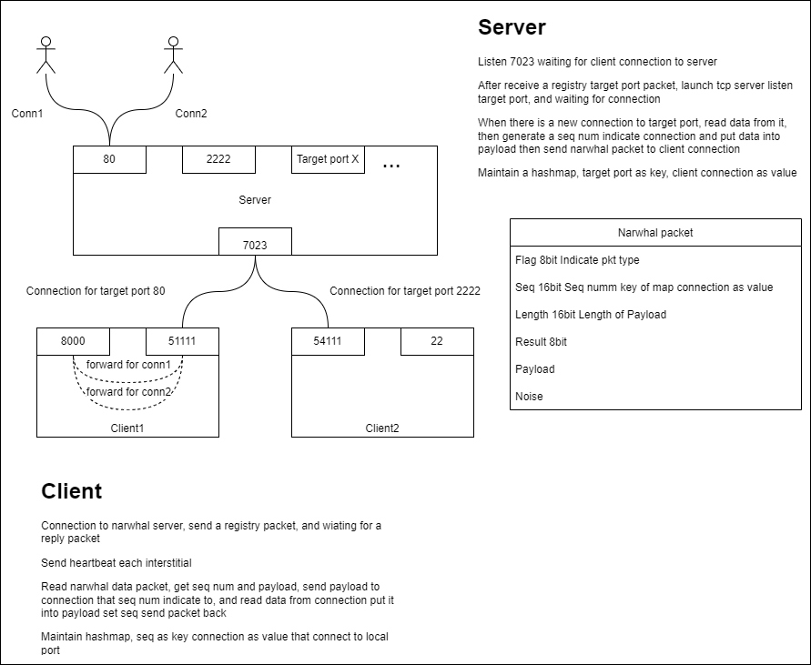

Narwhal
=======
Narwhal一个轻量的反向代理软件，可以将nat后的服务暴露到公网上。

Narwhal a lightweight reverse proxy application, let you expose server behind the nat to internet.

设计/Design
------

* Server启动后监听7023端口并接受连接，等待client发送注册请求包。包内带有目标端口信息(例如80)，server端收到请求后监听本地80端口，并记录连接信息到connMap中，key为remote address，value为conn。
* Server端启动一个goroutine，将连接到80端口的socket中的数据封装成narwhal数据包后转发到7023的tcp连接，后到达client。(Narwhal数据包中带有server和client的tcp连接的remote addr)
* Client收到数据后连接本地的转发端口(例如8000)，从连接到7023的tcp连接中的narwhal数据包解封并查看packet中的remote addr信息，如果存在，则从connMap中获取conn，并转发数据。如果不存在则连接8000端口，记录remote address和conn的映射关系，并转发数据。

Demo
----
Demo中有实现原理的小demon，demon中只解析原理，所以只处理一个tcp连接。